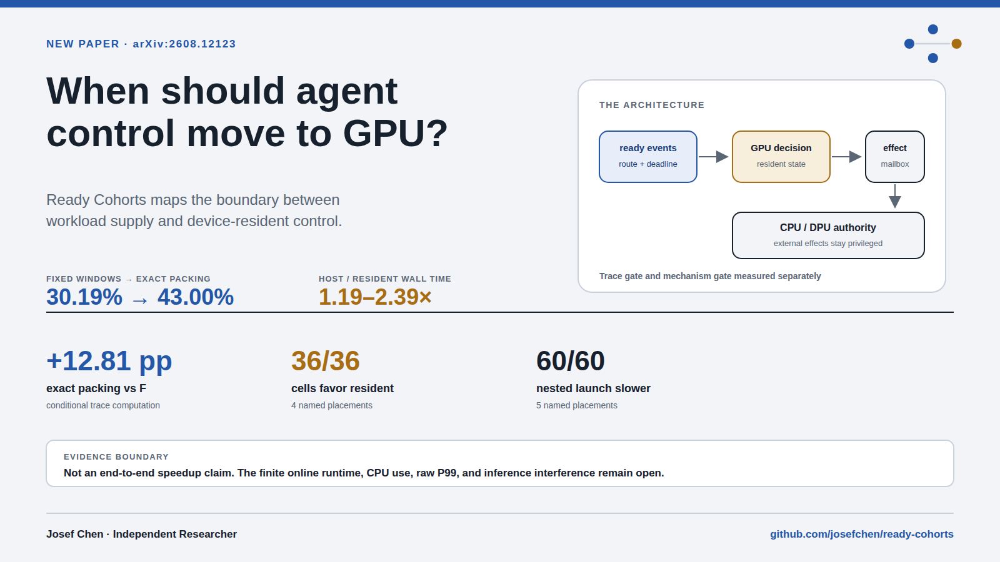
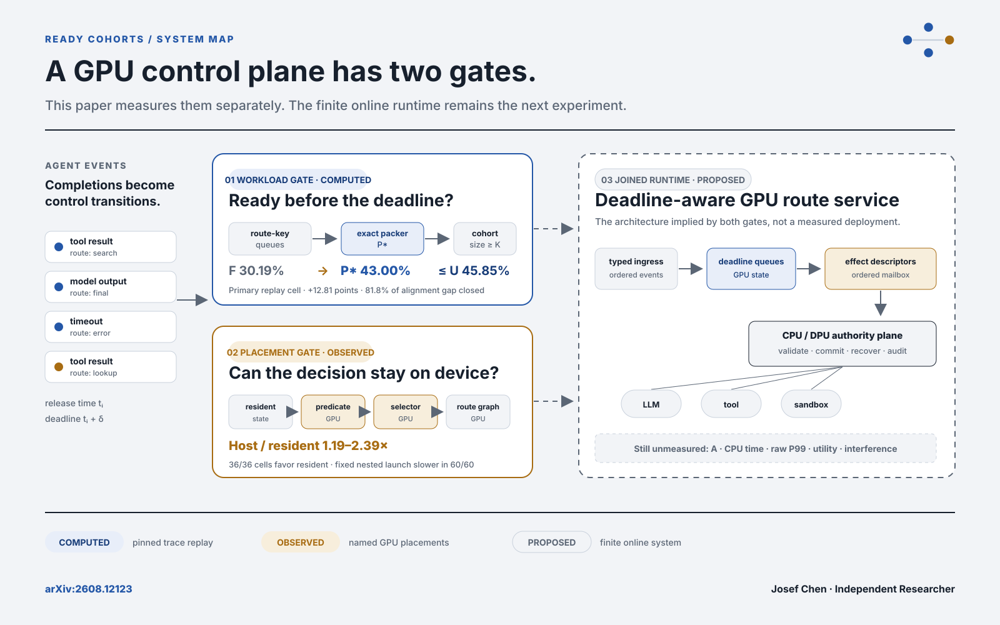

# Ready Cohorts Explorer

Interactive companion to *Ready Cohorts: Bounding GPU Opportunity and Avoiding
Host Round Trips in LLM-Agent Control* by Josef Chen, Independent Researcher.



## System map



The trace and mechanism studies are deliberately shown as separate inputs to a
future online runtime. The current release does not multiply the trace share by
the mechanism ratio or present the dashed runtime as measured.

The explorer answers three bounded questions:

1. How does ready-cohort opportunity change with active sessions, launch wait,
   route conditioning, and threshold K?
2. How does a device-resident binary decision compare with a matched host
   observation and redispatch bundle on four named GPU placements?
3. Why is fixed nested device launch retained as a negative control?

Every plotted value comes from a bundled CSV whose SHA-256 matches the public
release manifest. The app needs no API key and runs on CPU Basic.

## Canonical links

- [Paper on arXiv](https://arxiv.org/abs/2608.12123)
- [Hugging Face Paper page](https://huggingface.co/papers/2608.12123)
- [Paper PDF](https://huggingface.co/datasets/josefchen/ready-cohorts/resolve/ready-cohorts-arxiv-v1/paper/ready-cohorts.pdf)
- [Space source](https://github.com/josefchen/ready-cohorts/tree/main/spaces/ready-cohorts)
- [Frozen paper source](https://github.com/josefchen/ready-cohorts/tree/ready-cohorts-arxiv-v1)
- [Processed evidence](https://huggingface.co/datasets/josefchen/ready-cohorts/tree/ready-cohorts-arxiv-v1)
- [Pinned input trace](https://huggingface.co/datasets/Exgentic/agent-llm-traces/tree/f7c94012d0bfbf66fe4d6ed627699508bbb555ff)

## Evidence boundary

The trace replay is conditional on one pinned 851-session panel, one arrival
model, and nine generated swarms. The resident and native results are
descriptive named-placement measurements. They do not establish a hardware
population effect, CPU displacement, endpoint P99 improvement, end-to-end
agent speedup, or safe shared-inference execution.

The source chart contracts are recorded in [CHARTS.md](CHARTS.md).

## Citation

```bibtex
@misc{chen2026readycohortsboundinggpu,
  title         = {Ready Cohorts: Bounding GPU Opportunity and Avoiding Host Round Trips in LLM-Agent Control},
  author        = {Josef Liyanjun Chen},
  year          = {2026},
  eprint        = {2608.12123},
  archivePrefix = {arXiv},
  primaryClass  = {cs.DC},
  doi           = {10.48550/arXiv.2608.12123},
  url           = {https://arxiv.org/abs/2608.12123}
}
```
